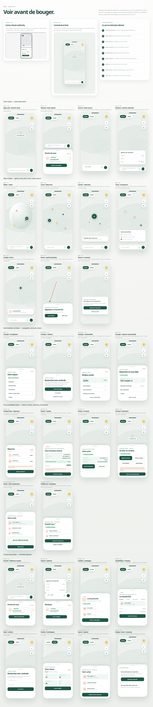

# Omni V2 — Species Maquette Contract

**Status:** Draft for owner approval before further Trunk or Branch implementation
**Method:** Nature Way — Phase 1, Species
**Visual authority:** The supplied Canva reference image and [`omni-species-maquette.html`](./omni-species-maquette.html)
**Parent authority:** [`../../v2-seed.md`](../../v2-seed.md)
**Interaction authority:** [`../../v2-flow.md`](../../v2-flow.md)
**Technical authority:** [`../../v2-roots.md`](../../v2-roots.md)

## 1. Purpose

This is the visual maquette companion for Omni’s Species. It exists because a prose description such as “map-first” is not sufficient to prevent visual drift. The first buyer frame must reproduce the supplied reference composition before the product adds states, data, seller operations or transaction surfaces.

The HTML maquette is a static visual board, not application code. It shows the initial reference frame and the required extensions in one consistent species. No screen may introduce a new layout language merely because its business state is more complex.



## 2. Reference frame that must not drift

The initial buyer frame is a full application viewport, not a dashboard and not a device mockup. Its visual order is fixed:

```text
upper-left: compact Acheter / Vendre segmented switch
upper-right: small circular J5/account indicator
right side: compact + and location controls
center map field: quiet marker and uppercase place label
map-only state: one bottom search dock in the bottom safe area
result state: the same dock in its own band above the lower grid/sheet
bottom result surface: white rounded sheet with centered handle
sheet heading: Proche de vous + Voir tout
sheet body: one complete card + partial next card
card action: one dark-green Vérifier la disponibilité CTA
```

The device border shown in the source image is a presentation frame only. The application itself fills the available viewport and keeps the same internal proportions. The reference image depicts the result state, where the search dock is visibly separated above the lower grid. The default map-only state places the dock at the bottom; it moves upward only when the lower result surface is present. The initial state is sparse; it does not add a logo wordmark, live-discovery chip, caption, left control rail, second search bar, filter grid, table or unrelated action.

## 3. Locked visual DNA

| Dimension | Locked rule |
|---|---|
| Spatial field | Pale grey-green map with quiet dot/spatial texture; real geography remains underneath |
| Primary surface | Near-white rounded bottom sheet; heavier than the search pill |
| Ink | Deep forest green/charcoal for headings and actions |
| Positive state | Soft mint pill with small uppercase status |
| Attention | Soft peach and restrained coral/orange marker accent |
| Controls | White circular or rounded controls with small shadow and generous spacing |
| Type | One readable sans-serif family; compact semibold headings; quiet metadata |
| Density | Sparse arrival; one primary action per surface; no decorative chrome |
| Motion | Calm, interruptible map movement; no motion that hides state or delays action |
| Surface ownership | Map stays mounted; sheets carry context; no generic dashboard replaces the map |

## 4. Screen and state inventory

Every row is part of the Species maquette. A unit inherits the arrival frame unless the row explicitly adds a new surface pattern. S00 and S01 distinguish the map-only dock from the result-state composition shown in the supplied reference. S18–S21 make the intermediate navigation and account surfaces explicit. S28–S34 make the map itself and its return behavior explicit.

| ID | Surface/state | Visual composition | User can do | Required truth |
|---|---|---|---|---|
| S00 | Buyer map-only | Full map with bottom-anchored dock and no lower result grid | Explore map, open search, use location | Public pin is not stock or trust proof |
| S01 | Buyer nearby result | Exact supplied reference composition with dock in a separate band above the lower sheet/grid | Scroll cards, open facility, view all | Public pin is not stock or trust proof |
| S02 | Search focused | Same map and top controls; bottom dock expands only enough for input, separate chevron and right-side search action | Enter a need, submit or open/close Options | Focus never pans or zooms the map |
| S03 | Search options | One attached white options surface opens upward from the dock; the dock remains below and the result grid remains absent or below a reserved gap | Choose category, quantity and budget; apply or clear | Options affect a typed search contract, not hidden server state |
| S04 | Nearby results | Dock occupies its own band above the white result sheet/grid; heading and horizontal rail preserve one full and one partial card | Scroll rail, open facility, view all | Card status distinguishes catalogue/source/availability |
| S05 | Facility detail | Same sheet material, back-to-map action, facility identity, trust badge and catalogue rows | Read public detail, inspect catalogue, start verification | Claim is not certification; private contact remains locked |
| S06 | Catalogue selection | Facility sheet becomes catalogue selection without abandoning map | Select an existing facility-scoped product | Buyer never retypes a product that already exists in catalogue |
| S07 | Availability steps | Four-step rhythm: Produit → Portée → Contraintes → Réponses | Choose product, confirm scope, set quantity/budget, send request | Availability is evidence request, not reservation or purchase intent |
| S08 | Auth unlock | Same map visible behind a white sheet | Sign in or create account, close and return | Account is required at protected search/availability boundary |
| S09 | Submitted/pending | Same sheet family, clear request status, expiry, resume action | Leave, return, refresh, inspect pending request | No response is invented; comparison stays pending until server evidence exists |
| S10 | Comparison | Same sheet family with comparable response cards | Compare eligible responses, select one | Only eligible server response can create intent |
| S11 | Purchase intent | Same map and sheet language, immutable snapshot summary | Confirm intent, open transaction room | Contact, itinerary, chat and QR unlock only after intent |
| S12 | Transaction room | Contextual transaction sheet/timeline, not public chat | View status, QR, external payment declaration and handoff | State transitions are server-authoritative and resumable |
| S13 | Seller arrival | Same map, Vendre active, owned facility is spatially contextualized | Open owned facility workspace | Role switch does not bypass ownership or trust |
| S14 | Seller workspace | Same sheet/cards, summary, requests and catalogue tabs | Respond to demand, manage products, correct auto-response | Seller actions are facility-scoped and audited |
| S15 | Trust/certification | Same sheet family with evidence checklist and admin outcome | Submit/resume evidence, read outcome | Claim creates verification request; admin certification produces unconfirmed |
| S16 | Wallet/Pro | Same sheet/card language; no second rechargeable wallet visual | Recharge Omni Wallet, allocate platform credit, view facility entitlement | Wallet is account-level and platform-only in V1 |
| S17 | Empty/error/recovery | Same sheet and map; honest copy and one next action | Retry, cancel, resume or return | Never show success copy for missing data or failed persistence |
| S18 | Account Navigation | J5-owned bottom sheet over the preserved map; role context, Rechercher, Mes demandes, Transactions, Vendre/Compte and close | Open a real destination, switch authorized context, close and return | No dead row; visitor entries remain public-safe |
| S19 | Guest Account | Account sheet opened from J5; explanation, Create account, Sign in and Continue on map | Start Auth or return to map | Public exploration remains available; protected actions remain locked |
| S20 | Authenticated Account | Account sheet opened from J5; identity, Omni Wallet summary, active requests/transactions, preferences and role switch | Open account-owned surfaces, switch authorized role, close and return | One wallet only; no invented balance or permission |
| S21 | Account Resume | J5 account sheet with pending request/transaction context, next action and safe return | Resume, inspect transactions, return to map | Resume reuses the original operation and never duplicates it |
| S22 | Comparison | Response sheet with facility, distance, freshness, price/offer and locked contact/itinerary actions | Compare eligible responses and select one | Only eligible server response can expose intent |
| S23 | Intent Review | Purchase-intent sheet with selected facility/product, quantity, coupon/offer, total and locked contact/itinerary note | Review immutable snapshot and confirm intent | Review does not unlock private data or create a transaction until confirmed |
| S24 | Intent Created | Server-confirmed transition sheet showing intent ID/state, selected offer and next transaction action | Open the transaction room or return safely | Intent is persisted once and is resumable |
| S25 | Contact/Itinerary Unlocked | Transaction sheet with permitted seller contact, itinerary/action and transaction context | Contact seller, open itinerary, return to timeline | These actions are visible only after server-confirmed intent |
| S26 | Transaction Room | Single transaction sheet with timeline, scoped chat, QR and external payment choices | Continue handoff, declare payment, resume later | Room owns the state machine; chat cannot advance it |
| S27 | Fulfilment/Rating | Transaction completion sheet with payment/fulfilment, receipt confirmation and rating | Confirm receipt, rate, recover from dispute/expiry | Completion follows seller/buyer state transitions |
| S28 | Idle Globe | Full map/world context with sparse pins or clusters, quiet marker density and slow idle motion | Observe, manually explore, open J5 or search | Rotation is interruptible; public pins are not supply |
| S29 | Local Fullscreen Map | Full local geographic context with stable camera, right controls and bottom dock | Explore nearby map, search, select cluster or pin | Location is explicit; camera never silently becomes precise |
| S30 | Cluster Selected | Selected cluster count and framed map context, with no availability badge | Expand cluster or zoom to members | Cluster count communicates density only |
| S31 | Facility Trust Markers | Map legend/status treatment for unclaimed, certified/unconfirmed and confirmed facilities | Inspect status and select a facility | Status is authoritative and does not imply stock or permission |
| S32 | Facility Focus | Selected pin/halo/label with prior result context recoverable | Open public detail or return to map | Selection never unlocks contact, itinerary or transaction |
| S33 | Route Visible | Honest route/itinerary layer to the permitted facility with transaction sheet | View route, return to room or close route | Route is available only after server-confirmed intent |
| S34 | Map Recovery / Return | Restored camera, query, selection and concise recovery copy | Retry, resume, back or return to map | Recovery never discards context or duplicates an operation |

## 5. State coverage for each substantial surface

The maquette does not only show happy paths. Every S00–S34 surface must have a designed state for the applicable entries below before its implementation gate closes.

| State | Visual requirement | Interaction requirement |
|---|---|---|
| Loading | Preserve the map and surface geometry; use a restrained placeholder | Prevent duplicate action; announce progress |
| Ready | Match the approved composition and data hierarchy | Expose only actions supported by the current state |
| Empty | Keep the same sheet language; explain what is absent | Offer one honest next action such as move, clear or return |
| Error | Use the same material with concise explanation | Retry is bounded; failure does not destroy safe context |
| Locked | Show why the action is unavailable and what unlocks it | Auth, trust, intent or permission gate is explicit |
| Success | Confirm the persisted operation and next state | Never claim success before server acknowledgement |
| Pending | Show owner, freshness/expiry and resume path | Refresh and re-entry preserve the request |
| Recovery | Explain interrupted state and offer resume/cancel | Never require users to guess whether an operation duplicated |

## 6. Responsive inheritance

The mobile frame is the source composition. Responsive layouts must preserve its hierarchy, not reinterpret it as a desktop dashboard. The dock is a first-class layout region, not an absolutely positioned decoration: the grid/sheet receives its own space, and the dock is placed before it with a measurable gap whenever both are visible.

| Viewport | Inherited composition |
|---|---|
| 320px | Full map; compact role switch; right controls; bottom dock in map-only; separated dock band above full-width result sheet; one readable card and safe partial next card |
| 375px | Same composition with more card breathing room and slightly more next-card visibility; dock/grid gap remains explicit |
| 768px | Full map remains dominant; sheet is bounded and centered; mobile anatomy is retained |
| 1280px | Full map remains dominant; bounded centered sheet/rail retains search-above-sheet relationship; no side dashboard |

At every width, keep independent safe zones for top controls, map controls, marker label, bottom dock, Options surface, sheet handle, sheet body and sheet footer. Keyboard focus, touch targets, reduced motion and no horizontal overflow are part of visual acceptance. The dock/grid gap is measured, not left to visual coincidence.

## 7. Dock interaction contract

The dock has four explicit modes. `Map-only` anchors the dock to the bottom safe area. `Result` places the same dock in a separate band above the result sheet/grid. `Focused` expands the input without moving the map and keeps a visible right-side submit action. `Options` opens one attached surface upward from the dock; it never becomes part of the result grid and never creates a second search bar.

The result grid and dock are separate layout siblings. Reserve the dock band before measuring the sheet/grid. The minimum visible gap is 8px on narrow mobile and 12–16px at wider widths. If the available viewport cannot fit both, reduce card visibility or collapse the grid before allowing overlap.

## 8. Visual inheritance and recursion

A nested feature inherits Species by default. It creates a mini-species only when it introduces a genuinely new surface or interaction pattern. The mini-species must show the parent composition, the new pattern, the states it adds and the exact reason inheritance is insufficient.

The structural path must be recorded. For example:

```text
product > buyer > availability > responses > comparison card > select response
```

The comparison card may inherit the sheet, typography, radius, spacing, status pills and action treatment. It needs a mini-species only if comparison introduces a visual pattern that does not exist in the approved maquette.

## 9. Dock-specific Species gate

The dock gate closes only when the maquette proves all four dock states: map-only bottom dock, result-state separated dock, focused dock with right-side submit, and options surface opening upward from the dock without entering the result grid. The dock and the result grid must be separate layout siblings with a measured gap at every required width.

The intermediate-surface gate closes only when the maquette shows the account/navigation sheet opened from J5 for a visitor and authenticated user, the role-aware entries, the pending context resume item and the safe return path for each. The post-availability gate also requires Comparison, Intent Review, Intent Created, Contact/Itinerary Unlocked, Transaction Room and Fulfilment/Rating states. No sheet may hide its navigation owner without a visible close/back rule.

## 10. Species gate

Species is not approved merely because the first screen looks attractive. The gate closes only when:

1. the supplied Canva frame is reproduced as S01;
2. S00–S34 have a written composition and applicable state coverage, including account-owned navigation, post-availability states and map-owned states;
3. the complete static maquette is available for review;
4. design tokens, surface ownership and responsive inheritance are explicit;
5. every new visual pattern has an owner and a mini-species decision;
6. Seed laws and Flow locks are visible in the maquette without inventing unsupported data;
7. the owner approves the set before Root System or Trunk work continues.

Until this gate is approved, application code is historical implementation evidence only. It must not define the Species by accident.

## References

[1]: ../../v2-seed.md "Omni V2 Seed"
[2]: ../../v2-flow.md "Omni V2 Flow and State Contract"
[3]: ../../v2-roots.md "Omni V2 Root System"
[4]: ./omni-species-maquette.html "Omni Species static visual maquette"
